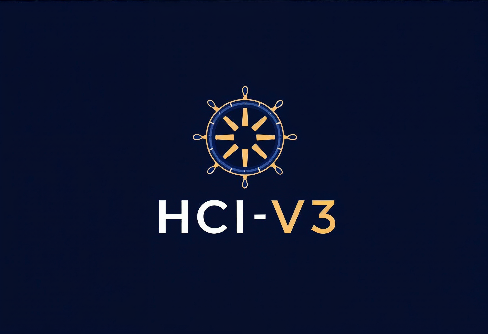

# HCI-V3 - Naval Helm Interface

<div align="center">



[](https://nextjs.org/)
[](https://www.typescriptlang.org/)
[](https://tailwindcss.com/)
[](LICENSE)

**A modern naval helm interface with voice command capabilities and real-time status updates.**

[Features](#features) • [Demo](#demo) • [Installation](#installation) • [Usage](#usage) • [Documentation](#documentation)


</div>

## 🚀 Features

### Core Capabilities
- 🎙️ **Voice Command Recognition** - Offline-capable using Vosk
- 🧠 **AI-Powered Processing** - Natural language understanding with Google Gemini
- 🔊 **Voice Responses** - Natural speech synthesis via ElevenLabs
- 🎯 **Real-time Visualization**
  - Dynamic compass display with course tracking
  - Interactive engine telegraph
  - Precise rudder angle indicator
  - Command history logging

### Technical Features
- 🌓 Dark/Light theme support with modern UI
- 💻 Cross-platform compatibility (Windows, macOS)
- 🌐 Browser support (Chrome, Safari, Edge)
- ⚡ Offline-capable voice recognition
- 🔒 Secure API key management

## 🎮 Demo

### Voice Commands
The system understands natural language helm commands:
```
"Helm, right 15 degrees rudder, steady on course zero niner zero"
"Helm, all ahead two-thirds, come left to heading one eight zero"
"Helm, rudder amidships, all ahead full, steady as she goes"
```

## 🛠️ Installation

### Prerequisites
- Node.js 18+
- Google Gemini API key
- ElevenLabs API key

### Quick Start
1. **Clone the repository**
   ```bash
   git clone https://github.com/jakerains/HCI-V3.git
   cd HCI-V3
   ```

2. **Install dependencies**
   ```bash
   npm install
   ```

3. **Configure API Keys**
   
   Choose one of these options:

   **Option A: Using `.env.local`**
   ```env
   NEXT_PUBLIC_GEMINI_API_KEY=your_key_here
   NEXT_PUBLIC_ELEVENLABS_API_KEY=your_key_here
   ```

   **Option B: Using Settings Page**
   - Launch the application
   - Navigate to Settings
   - Enter your API keys
   - Click "Save Keys"

4. **Start the development server**
   ```bash
   npm run dev
   ```
   Access the application at http://localhost:3000

## 🎯 Voice Recognition Models

Choose from multiple Vosk models based on your needs:

| Model | Size | Performance | Use Case |
|-------|------|-------------|-----------|
| Small (English) | ~40MB | Fastest | Basic commands |
| Medium (English) | ~1.8GB | Balanced | General use |
| Large (English) | ~2.3GB | Best accuracy | Clear speech |

Models can be downloaded and managed through the Settings page.

## 🏗️ Architecture

The application runs on two concurrent servers:
- Next.js frontend (Port 3000)
- WebSocket server for voice recognition (Port 2700)

### Project Structure
```
HCI-V3/
├── components/     # React components
├── pages/         # Next.js pages & API routes
├── lib/           # Utilities & configuration
├── hooks/         # Custom React hooks
└── public/        # Static assets & models
```

## 🔑 API Keys

### Google Gemini API
1. Visit [Google AI Studio](https://makersuite.google.com/app/apikey)
2. Create a new API key
3. Use in application

### ElevenLabs API
1. Visit [ElevenLabs](https://elevenlabs.io/subscription)
2. Create an account
3. Get your API key
4. Use in application

## 🤝 Contributing

Contributions are welcome! Please feel free to submit a Pull Request.

## 📄 License

This project is licensed under the MIT License - see the [LICENSE](LICENSE) file for details.

---

<div align="center">
Made with ❤️ by Jake Rains
</div>
